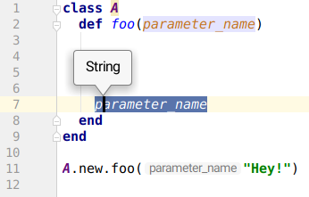
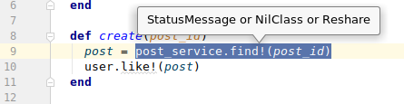

# ruby-type-inference features

This doc contains `ruby-type-inference` features which can be useful 
for you after running your ruby program under type tracker:

## Type providing for method parameters

## Type providing for return value

## Side notes

As now RubyMine has more information about types it can provide 
more reliable code completion, code analysis and other code insight features
