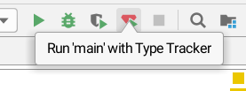

Automated Type Contracts Generation [](https://confluence.jetbrains.com/display/ALL/JetBrains+on+GitHub) [](https://travis-ci.org/JetBrains/ruby-type-inference)
===================================

`ruby-type-inference` project is a completely new approach to
tackle the problems Ruby dynamic nature and provide more reliable
symbol resolution and type inference. It collects some run time data
to build type contracts for the methods.

Every time a method is being called, some arguments of
particular types are being passed to it. Type Tracker collects
all such argument combinations and then builds a special contract
which satisfies all encountered argument type tuples. 

The approach has its own pros and cons:
* The obtained contracts utilize real-world usages of code of
  any complexity so it provides true results even if a method
  utilizes dynamic Ruby features heavily.
* The completeness of the contracts obtained for a method highly
  depends on the coverage of that method, including its callees.
  That implies the need to merge the data obtained from the
  different sources (e.g. different projects using the same gem).
  
This implementation addresses the stated coverage problem by providing
the possibility to merge any type contracts at any time.
     
## Usage

For simple usage you need to install [Ruby Dynamic Code Insight](https://plugins.jetbrains.com/plugin/10227-ruby-dynamic-code-insight) 
plugin for RubyMine. Then this plugin will require [arg_scanner](https://rubygems.org/gems/arg_scanner) gem to be installed.
See [arg_scanner installation instruction](arg_scanner/README.md#installation) if you have problems while installation. 

After that you will have possibility to run your programs under type tracker:



Or you can run your programs in terminal via `rubymine-type-tracker` binary (But you have to keep your project opened 
in RubyMine). E.g.:
```
rubymine-type-tracker bin/rails server
```

`rubymine-type-tracker` binary is included into [arg_scanner](https://rubygems.org/gems/arg_scanner) gem.

See [FEATURES.md](FEATURES.md) for understanding what benefits you will have after running your program under type tracker.
     
## Architecture
 
* **arg_scanner** is a gem with a native extension to attach to 
  ruby processes and trace and intercept all method calls to log 
  type-wise data flow in runtime.
  
  See [`arg_scanner`] documentation for details on usage.

* [**Type contract processor**](contract-creator) server listens for
  incoming type data (from `arg_scanner`) and processes it to a compact format.
  
  The data stored may be used later for better code analysis and also
  can be shared with other users.

* Code analysis clients (a RubyMine/IJ+Ruby [plugin](ide-plugin)) use the contract data
  to provide features for the users such as code completion, better resolution, etc.

* (_todo_) Signature server receives contracts anonymously from the users and provides
  a compiled contract collections for popular gems.

## Running project from sources

#### Prerequisites

The [`arg_scanner`] gem is used for collecting type information. It can be installed manually 
to the target SDK and requires MRI Ruby at least 2.3.

#### Running type tracker

There are two possibilities to use the type tracker:
_(I)_ using IJ/RubyMine plugin or _(II)_ requiring it from Ruby code.

##### Using RubyMine plugin

The easiest way to run the plugin (and the most convenient for its development) is
running it with special gradle task against IJ Ultimate snapshot:
 
```
./gradlew ide-plugin:runIde
```

The task will compile the plugin, run IJ Ultimate with plugin "installed" in it.
There is no need in running anything manually in that case.

If you want to try it with existing RubyMine instance,
you should:

1. Build it via `./gradlew ide-plugin:buildPlugin`
2. Install plugin in the IDE
    * Navigate to `File | Settings | Plugins | Install plugin from disk...`
    * Locate plugin in `ide-plugin/build/distributions` and select.
    * Restart IDE.

Note that due to API changes the plugin may be incompatible with older RM instances.

##### Using command line

1. In order to collect the data for the script needs a contract server to be up and running;
   it could be run by running
   ```sh
   ./gradlew contract-creator:runServer --args path-to-db.mv.db
   ```
   where `path-to-db.mv.db` is path where type contracts will be stored (H2 database file).

1. Run the ruby script to be processed via [`arg-scanner`](arg_scanner/bin/arg-scanner)
   binary.

1. Use the data collected by the contract server.

## Contributions

Any kind of ideas, use cases, contributions and questions are very welcome
as the project is just incubating.
Please feel free to create issues for any sensible request.

[`arg_scanner`]: arg_scanner/README.md